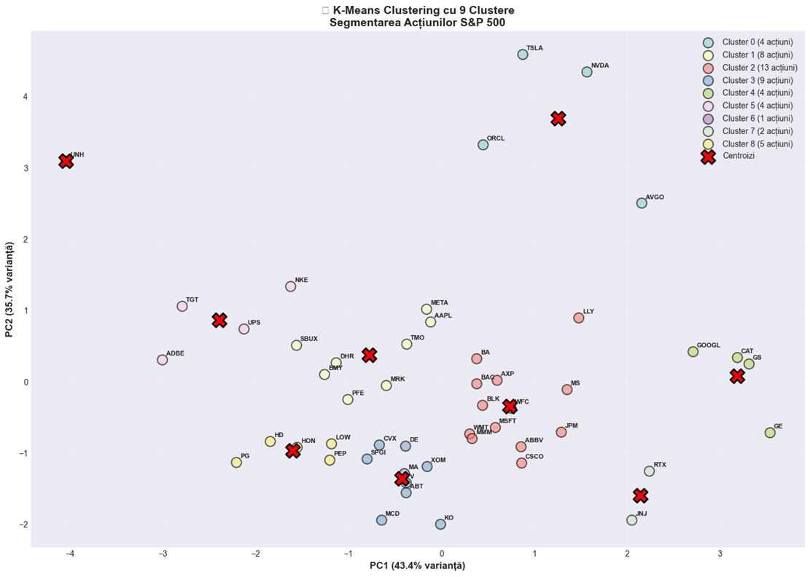
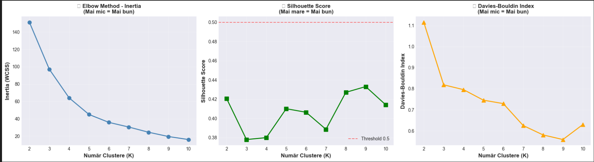
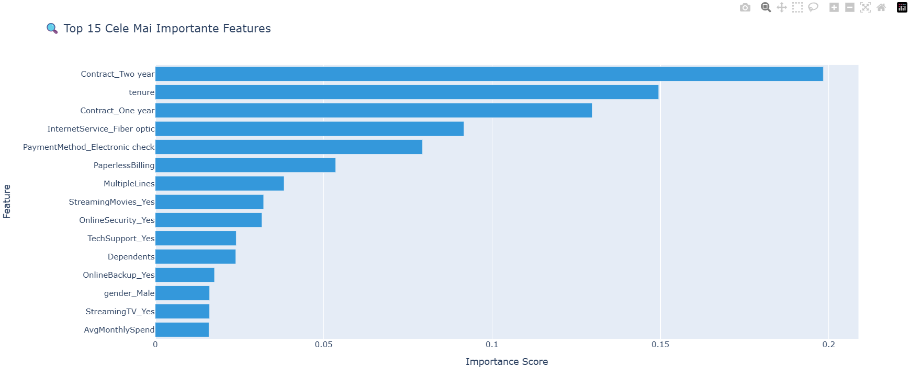

# 📊 End-to-End Data Science & Analytics
This repository showcases my ability to extract actionable insights from raw data using statistical modeling and machine learning.

## 📈 Featured Notebooks

### 1. Customer Churn Prediction (Telecom)
- **Impact:** Developed a predictive system to identify at-risk customers with **ROC-AUC > 0.85**.
- **Key Techniques:** Feature Engineering, Class Imbalance handling (SMOTE), and Interactive Plotly Dashboards.
- **File:** `churn_prediction_system.ipynb`

### 2. Marketing Optimization & A/B Testing
- **Impact:** Bridging my Marketing background with Data Science. Implemented **Multi-Armed Bandit** algorithms and statistical significance tests (Chi-squared).
- **File:** `marketing_ab_real_data.ipynb`

### 3. Financial Market Segmentation (S&P 500)
- **Focus:** Unsupervised Learning.
- **Key Techniques:** PCA (Dimensionality Reduction) and K-Means Clustering to group stocks based on market behavior.
- **File:** `Unsupervised_Learning_Segmentare_Actiuni_SP500.ipynb`

### 4. Credit Risk Assessment
- **Focus:** Propensity scoring for loan defaults using Logistic Regression and LDA.
- **File:** `Credit_Risk_Prediction_v2.ipynb`

## 🧪 Tech Stack
- **Languages:** Python, SQL, R.
- **Libraries:** Pandas, Scikit-learn, Seaborn, Plotly, Folium.
- **Expertise:** Predictive Analytics, Statistical Testing, Data Visualization.

### Visualizing Model Performance

