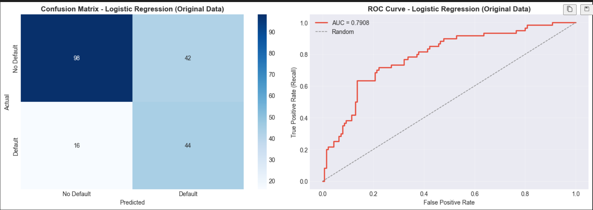

# 📊 End-to-End Data Science & Analytics

This repository showcases my ability to extract actionable insights from raw data using statistical modeling and machine learning.

## 📈 Featured Notebooks

### 1. Customer Churn Prediction (Telecom)
- **Impact:** Developed a predictive system to identify at-risk customers with **ROC-AUC > 0.85**.
- **Key Techniques:** Feature Engineering, Class Imbalance handling (SMOTE), and Interactive Plotly Dashboards.
- **File:** `churn_prediction_system.ipynb`

### 2. Marketing Optimization & A/B Testing
- **Impact:** Bridging my Marketing background with Data Science. Implemented **Multi-Armed Bandit** algorithms and statistical significance tests (Chi-squared).
- **File:** `marketing_ab_real_data.ipynb`

### 3. Financial Market Segmentation (S&P 500)
- **Focus:** Unsupervised Learning.
- **Key Techniques:** PCA (Dimensionality Reduction) and K-Means Clustering to group stocks based on market behavior.
- **File:** `Unsupervised_Learning_Segmentare_Actiuni_SP500.ipynb`

### 4. Credit Risk Assessment
- **Focus:** Propensity scoring for loan defaults using Logistic Regression and LDA.
- **File:** `Credit_Risk_Prediction_v2.ipynb`

---

## 🐳 Docker Support

Each project includes Docker configuration with **Jupyter Lab** for interactive analysis.

### Quick Start

```bash
# Clone the repository
git clone https://github.com/sebikradyel1-svg/End-to-End-Data-Science.git
cd End-to-End-Data-Science

# Build and run any project
cd Churn_Prediction_System
docker build -t churn:latest .
docker run -p 8888:8888 churn:latest

# Open browser: http://localhost:8888
```

### Available Docker Images

| Project | Build Command | Run Command | Access |
|---------|---------------|-------------|--------|
| **Churn Prediction** | `docker build -t churn .` | `docker run -p 8888:8888 churn` | http://localhost:8888 |
| **Marketing A/B** | `docker build -t ab-test .` | `docker run -p 8888:8888 ab-test` | http://localhost:8888 |
| **Credit Risk** | `docker build -t credit .` | `docker run -p 8888:8888 credit` | http://localhost:8888 |

### Mount Your Own Data

```bash
# Run with local data folder
docker run -p 8888:8888 -v $(pwd)/data:/app/data churn:latest
```

### Docker Features

- ✅ **Jupyter Lab** - Interactive notebook environment
- ✅ **Pre-installed libraries** - pandas, sklearn, plotly, seaborn
- ✅ **Multi-stage builds** - Optimized image sizes
- ✅ **Non-root user** - Security best practices

---

## 🧪 Tech Stack

- **Languages:** Python, SQL, R
- **Libraries:** Pandas, Scikit-learn, Seaborn, Plotly, Folium
- **Expertise:** Predictive Analytics, Statistical Testing, Data Visualization
- **DevOps:** Docker, Containerization

---

## 📊 Visualizing Model Performance




---

## 📫 Connect with me

- **LinkedIn:** [www.linkedin.com/in/paul-sebastian-kradyel](http://www.linkedin.com/in/paul-sebastian-kradyel)
- **Email:** [paulsebastiankradyel@gmail.com](mailto:paulsebastiankradyel@gmail.com)
